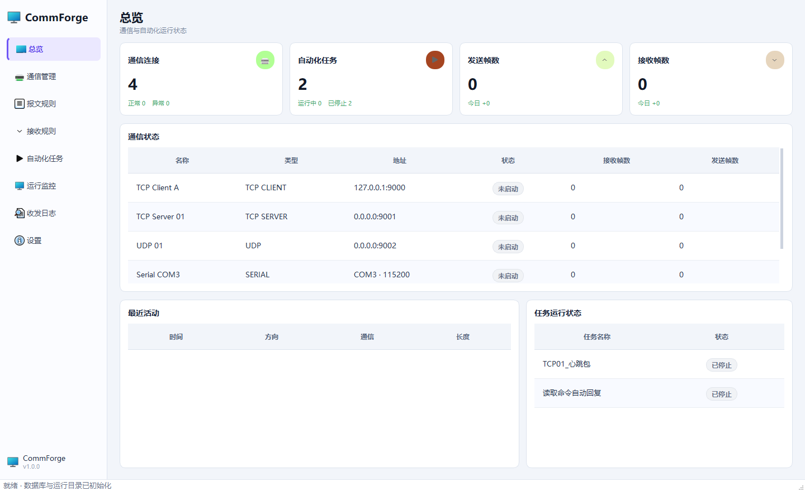
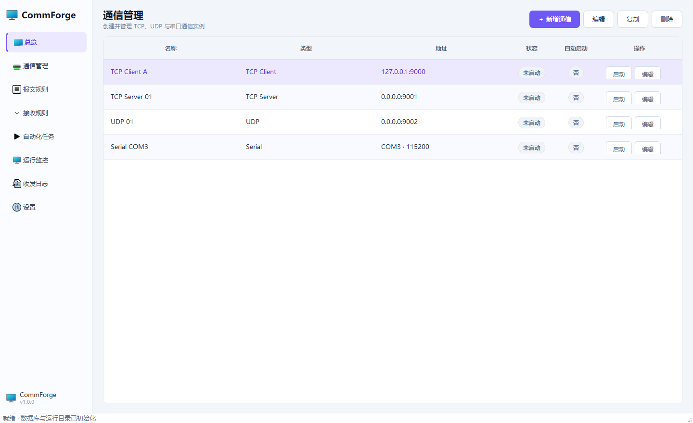
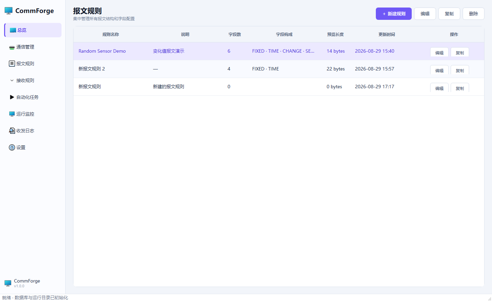
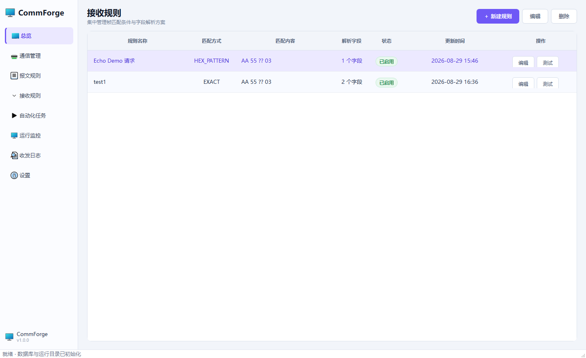
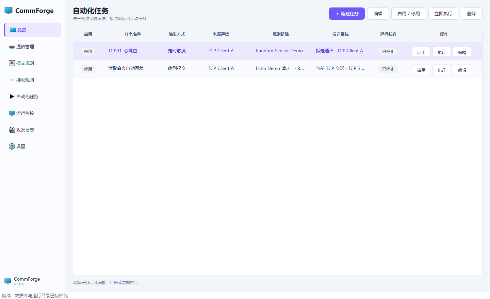
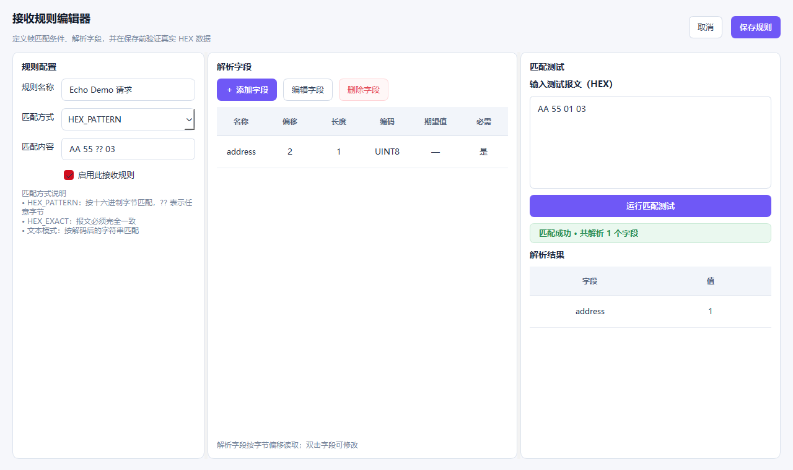
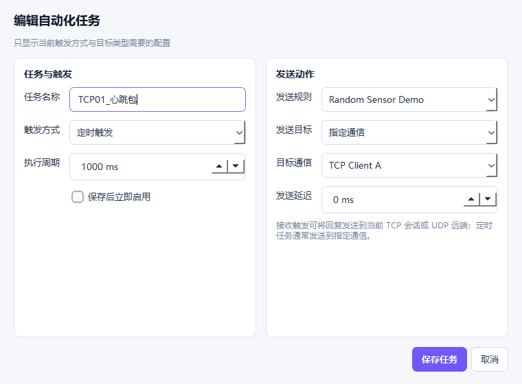

# CommForge

[](https://github.com/youhao-dev/commforge/actions/workflows/build-release.yml)
[](https://www.python.org/)
[](https://doc.qt.io/qtforpython-6/)

CommForge 是一款面向通信调试、设备模拟和协议验证的桌面工具。它把通信连接、报文生成、接收解析与自动化任务拆成可复用配置，适合在不编写一次性脚本的情况下搭建 TCP、UDP、串口测试流程。



## 核心能力

| 模块 | 能力 |
| --- | --- |
| 通信管理 | TCP Client、TCP Server、UDP、Serial 多实例配置、独立启停和自动重连 |
| 报文规则 | 可视化字段排序，支持固定值、时间、变化值、随机值、序列、长度、校验和及接收值引用 |
| 接收规则 | EXACT、CONTAINS、前后缀、正则、HEX_EXACT、HEX_PATTERN 匹配与定长字段解析 |
| 自动化任务 | TIMER、RECEIVE、MANUAL、CONNECTED 触发，支持指定通信、当前会话与多种发送目标 |
| 运行监控 | 连接状态、发送/接收计数、任务状态和最近活动统一展示 |
| 收发日志 | 最多 5000 条实时记录，支持通信、方向、HEX/ASCII 搜索与完整报文查看 |
| 持久化 | SQLite + SQLAlchemy 2.x，WAL、外键约束、引用删除保护和轮转文件日志 |

## 界面预览

| 通信管理 | 报文规则 |
| --- | --- |
|  |  |

| 接收规则 | 自动化任务 |
| --- | --- |
|  |  |

| 接收规则编辑器 | 自动化任务编辑器 |
| --- | --- |
|  |  |

完整页面截图存放在 [`docs/images`](docs/images)，详细操作见 [`docs/USER_GUIDE.md`](docs/USER_GUIDE.md)。

## 下载与运行

每次向 `master` 或 `main` 推送代码，GitHub Actions 都会在六种原生环境中测试并打包：

| 系统 | x64 | ARM64 |
| --- | :---: | :---: |
| Windows | `windows-2025` | `windows-11-arm` |
| Linux | `ubuntu-24.04` | `ubuntu-24.04-arm` |
| macOS | `macos-15-intel` | `macos-15` |

普通构建的 ZIP 可在对应 Actions 运行记录的 **Artifacts** 中下载，保留 14 天。推送 `v*` 标签后，六个平台压缩包和 SHA-256 校验文件会自动发布到 [Releases](https://github.com/youhao-dev/commforge/releases)。

下载后直接解压整个 `CommForge` 目录：

- Windows：运行 `CommForge.exe`。
- Linux：为 `CommForge` 添加执行权限后运行；桌面环境还需要系统提供常见的 X11/XCB 图形库。
- macOS：运行包内可执行文件。当前流水线不包含 Apple 开发者签名，首次启动可能需要在“隐私与安全性”中确认。

运行时数据库和日志分别写入可执行文件旁的 `data/` 与 `logs/`，更新版本时请保留 `data/commforge.db`。

## 从源码启动

需要 Python 3.12。建议使用虚拟环境：

```bash
python -m venv .venv
```

Windows：

```powershell
.\.venv\Scripts\Activate.ps1
python -m pip install -r requirements.txt
python main.py
```

Linux / macOS：

```bash
source .venv/bin/activate
python -m pip install -r requirements.txt
python main.py
```

运行测试和界面回归：

```bash
python -m pytest -q -p no:cacheprovider
python scripts/capture_redesign.py
```

界面回归使用 Qt 离屏渲染，不会连接真实网络或串口，也不会真实发送报文。生成结果会覆盖 `docs/images/qa-*.png`。

## 项目结构

```text
commforge/
├─ .github/workflows/            # 六平台构建与标签发布流水线
├─ commforge/
│  ├─ app/                       # 启动流程与源码/冻结运行路径
│  ├─ automation/                # 自动化调度与执行引擎
│  ├─ communication/             # TCP、UDP、串口通道和拆包器
│  ├─ core/                      # 枚举、异常和运行时上下文
│  ├─ database/                  # SQLAlchemy 模型与数据库初始化
│  ├─ message/                   # 字段、Codec、校验和与报文构建器
│  ├─ receive/                   # 接收匹配和字段解析
│  ├─ repositories/              # CRUD 与引用保护
│  ├─ services/                  # UI 使用的应用服务层
│  ├─ ui/                        # 主窗口、页面、通用控件与主题
│  └─ utils/                     # 轮转日志
├─ docs/                         # 用户指南、构建文档和项目内截图
├─ scripts/                      # 截图回归与发布压缩脚本
├─ tests/                        # 核心逻辑、仓储和打包测试
├─ CommForge.spec                # PyInstaller 目录打包配置
├─ main.py                       # 桌面应用入口
└─ pyproject.toml                # 项目元数据与依赖声明
```

## 设计与架构

系统将“如何通信”“如何生成报文”“如何识别接收数据”“何时执行动作”分成独立层。数据库只保存静态配置；变化值、序号、连接会话和统计保存在 `RuntimeContext`；UI 通过 `ApplicationServices` 访问业务能力，不直接操作 SQL 或 Socket。

- 新增通信类型：实现 `CommunicationChannel` 的 `open()`、`close()`、`_write()`，再通过 `CommunicationManager.register()` 注册。
- 新增字段生成器：继承 `FieldGenerator` 并注册到 `FieldGeneratorRegistry`。
- 新增编码：向 `CodecRegistry` 注册编码器和解码器。
- 新增校验：实现接收 `bytes` 并返回整数的函数，再注册到 `ChecksumRegistry`。

本地构建、流水线矩阵和发布步骤详见 [`docs/BUILD_AND_RELEASE.md`](docs/BUILD_AND_RELEASE.md)。界面审计和回归记录见 [`design-qa.md`](design-qa.md)。

## 数据安全说明

- 通信、规则和任务配置仅保存在本地 SQLite 数据库中。
- 收发日志可能包含设备报文，请在分享 `data/`、`logs/` 或截图前检查敏感内容。
- 删除被自动化任务引用的通信或规则时，仓储层会阻止破坏性删除。
- 项目当前未配置代码签名证书；发布 ZIP 提供 SHA-256 文件用于完整性校验。
