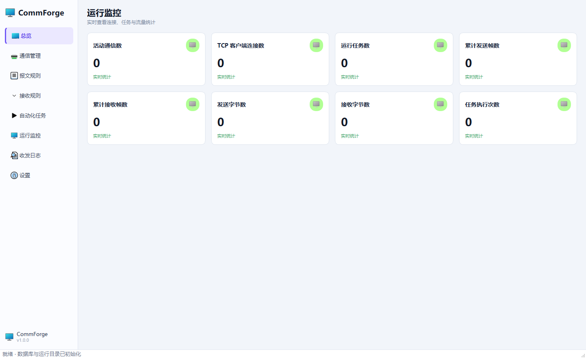
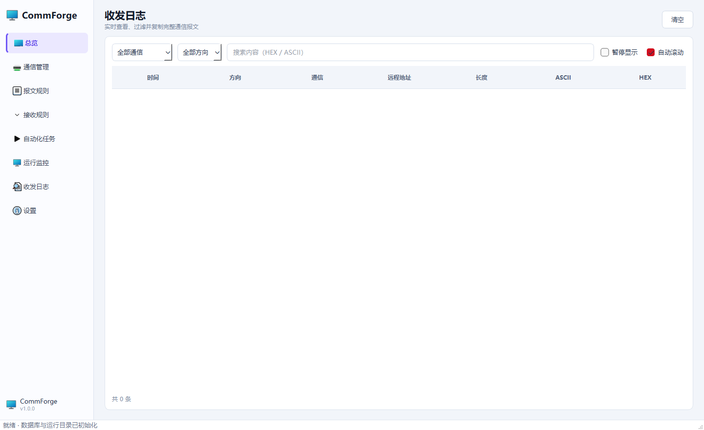

# CommForge 使用指南

本文从建立连接到自动应答介绍一条完整工作流。界面中的列表均支持单击选中，关键操作也会在页面底部显示结果。

## 1. 总览

总览集中展示通信实例数量、自动化任务、发送/接收帧数、通信状态、最近活动和任务状态。它适合在运行前确认配置是否齐全，也适合在联调中快速发现连接异常。

## 2. 配置通信

进入“通信管理”，点击“新增通信”，选择实际协议后填写对应参数。编辑窗口只显示当前协议需要的字段：

- TCP Client：目标主机和端口，可配置断线自动重连。
- TCP Server：本地监听地址和端口，接收连接后可向当前会话回复。
- UDP：本地绑定地址/端口与默认远端地址/端口。
- Serial：串口号、波特率、数据位、停止位、校验位和流控。

拆包方式决定字节流如何切成完整帧。UDP 天然按数据报分帧；TCP 和串口可根据协议选择 RAW、分隔符、固定长度、长度字段或空闲超时。

保存后使用行内“启动”按钮建立连接。修改正在运行的通信前建议先停止，避免旧连接继续占用端口。

## 3. 创建发送报文

“报文规则”主页面一行代表一条规则。新增或编辑后进入字段编辑器，字段从上到下按顺序生成：

- 固定值：协议头、命令字、结束符等常量。
- 时间：当前时间的格式化文本或时间戳。
- 变化值/随机值/序列：模拟连续变化的设备数据。
- 长度：将当前报文或指定范围长度写入字段。
- 校验和：对指定字节范围执行 XOR、SUM、CRC 等算法。
- 接收值/接收字节：自动应答时复用接收帧的解析结果。

右侧 HEX/ASCII 预览可以“生成一次”或“连续 5 次”，用于确认随机值、序列和变化值行为。保存规则前应核对总字节数、字节序和校验范围。

## 4. 创建接收规则

接收规则负责判断一帧是否属于某种消息。主页面只展示规则列表；新增、编辑和测试在独立编辑器完成。

常用匹配方式：

- `HEX_EXACT`：整帧必须完全一致。
- `HEX_PATTERN`：十六进制模式匹配，`??` 可表示任意单字节。
- `EXACT` / `CONTAINS` / 前后缀：按文本内容匹配。
- 正则：适合文本协议中的可变格式。

解析字段使用偏移、长度和编码从接收帧取值。保存前在右侧输入真实 HEX 数据并点击“测试匹配”，成功后会同时显示字段解析结果。

## 5. 配置自动化任务

自动化任务把触发器、通信、接收规则、发送规则和目标组合成执行链：

- 定时触发：按间隔周期发送心跳、采样值或广播帧。
- 接收触发：匹配指定接收规则后生成回复报文。
- 手动触发：通过“立即执行”按钮按需发送。
- 连接触发：通信建立后发送初始化或握手报文。

编辑器仅显示当前触发方式和目标类型相关的配置。任务创建后可单独启用、停用、编辑、立即执行或删除。立即执行不要求任务处于启用状态，但通信必须已经启动。

## 6. 运行监控与收发日志

运行监控用于检查当前连接、任务和累计计数。需要排查具体内容时进入“收发日志”。

日志支持按通信、方向和 HEX/ASCII 关键字筛选。查看详情可以读取完整报文，避免表格摘要截断长帧。界面只保留最近 5000 条记录，文件日志则按大小轮转。

## 7. 数据备份和升级

源码运行时，数据位于项目目录：

- `data/commforge.db`：通信、规则和任务配置。
- `logs/commforge.log`：应用运行日志。

打包版本中这两个目录位于可执行文件旁。升级时先关闭 CommForge，备份 `data/commforge.db`，再替换应用文件。不要在程序运行期间复制数据库主文件，否则可能漏掉 WAL 中尚未合并的数据。

## 常见问题

### TCP Server 已启动但无法回复

检查自动化任务目标是否为当前 TCP 会话，并确认接收规则已匹配。没有活动客户端连接时，服务器没有可回复的目标。

### 串口显示异常

确认串口未被其他软件占用，并核对波特率、数据位、停止位和校验位。Windows 设备管理器中的端口号必须与配置一致。

### 报文校验值不正确

检查校验字段的计算范围是否包含了校验字段自身，以及输出 Codec 的字节序。校验通常只覆盖校验字段之前的内容。

### macOS 提示应用无法验证

自动构建产物未使用 Apple 开发者证书签名。可在系统设置的“隐私与安全性”中确认来源，或从源码运行。生产分发建议自行配置签名和公证。
